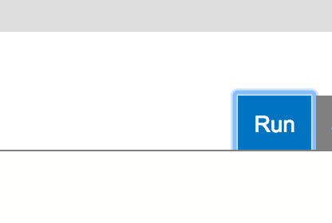
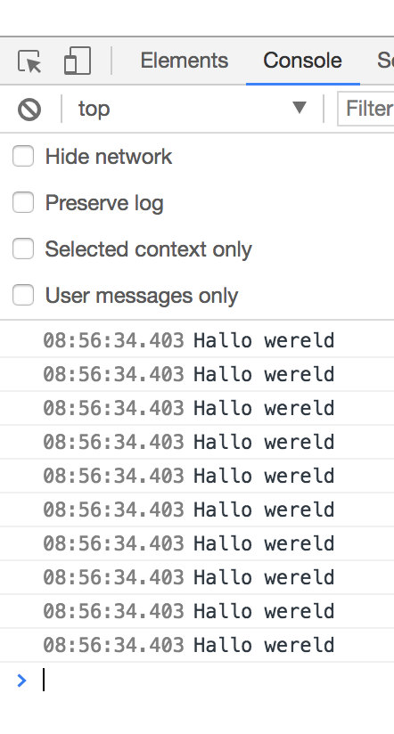
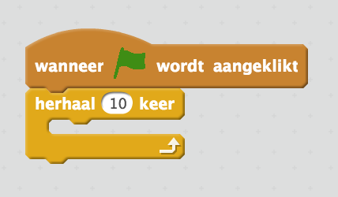

# Workshop TypeScript

(let op: we maken tijdens deze workshop gebruik van [Chrome](https://www.google.nl/chrome/browser/desktop/index.html)!)

## Wat is TypeScript

TypeScript is een programmeertaal die een uitbreiding is van JavaScript. JavaScript wordt momenteel veel gebruikt om websites mee te maken. 

Het bijzondere van TypeScript is dat een TypeScript programma eerst omgezet moet worden naar JavaScript voordat het uitgevoerd kan worden in bijvoorbeeld een browser.

TypeScript is een programmeertaal die je gewoon in een tekst editor kan intypen. Dat is anders bij bijvoorbeeld Scratch. Daar sleep je blokjes en koppel je deze aan elkaar.

Toch lijken TypeScript en Scratch heel erg op elkaar! Elk blokje dat je kent vanuit Scratch, kan je ook in TypeScript gebruiken door het juiste in je tekst editor in te typen.

## De TypeScript playground

Wij gaan, om voorlopig niets te hoeven installeren, gebruik maken van de **typescript playground**. Deze kan je [hier](https://www.typescriptlang.org/play/) vinden. Open deze link maar eens in een nieuwe tab en zet ze naast elkaar zodat je aan de ene kant kunt lezen en aan de andere kant meteen kunt uitproberen.

Elke keer als je op "run" drukt dan wordt je TypeScript programma omgezet naar JavaScript en wordt deze op een nieuwe tab in je browser geopend.



## Een klein voorbeeld

Type dit programma link in het TypeScript venster (dus links) in:

```typescript
for (let i = 0; i < 10; i++) {
    console.log("Hallo wereld");
}
```

*Dit programma laat 10 keer de tekst "Hallo wereld" zien*

Als je nu op "Run" drukt, opent er een venster maar lijkt er nog niets te gebeuren. Hoe kan dit?

Jouw programma in TypeScript wordt omgezet naar JavaScript, dan opent er een venster in je browser om dit stuk JavaScript uit te gaan voeren. Maar omdat de `console.log("Hallo wereld");` instructie de computer zegt dat hij iets op de "JavaScript console" moet zetten, doet hij dit netjes, maar toont hij niets in het venster.

*De JavaScript console is een hulpmiddel voor programmeurs om te kijken wat er tijdens het uitvoeren van JavaScript code op een web pagina allemaal gebeurt*

Open dus de JavaScript console door in het menu op `Weergave|Ontwikkelaar|Javascript-console` te drukken.

Je ziet nu de console:



Ons programma heeft dus 10x de tekst "Hallo wereld" afgedrukt op de JavaScript console.

Dit kan je vergelijken met het onderstaande stukje Scratch:



Zie je de overeenkomst met het programma in TypeScript?

Voordat we nu helemaal de diepte in duiken, gaan we echt bij het begin beginnen: variabelen. 


