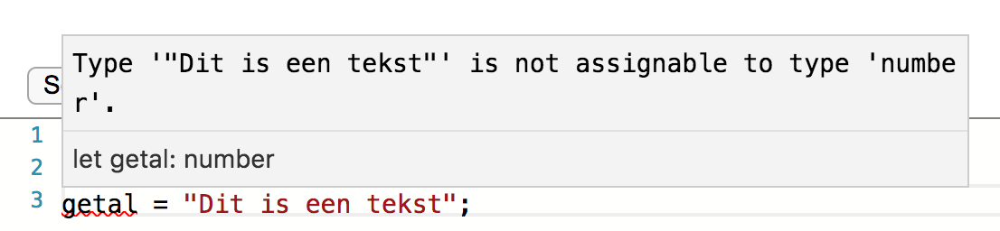

# Het begin: variabelen

Je herinnert je misschien nog wel het stukje code wat we in ons eerste voorbeeld hebben gebruikt:

```typescript
for (let i = 0; i < 10; i++) {
    document.write("Hallo wereld<br>");
}
```

Hierin wordt eigenlijk al een *variabele* gebruikt. In dit geval een getal met de naam **i**. Een variabele is een stukje geheugen waar je een *waarde* in kunt zetten en uit kunt lezen.

De `for` lus heeft drie delen tussen de haken staan:

```
for (BEGIN; ZOLANG; NA) {
    `... opdrachten binnen de lus ...`
}
```

De delen `BEGIN`, `ZOLANG` en `NA` worden elk door de computer uitgevoerd aan het **BEGIN** van de lus, 
voor **ZOLANG** deze conditie WAAR (true) is en **NA** elke lus wordt weer een andere opdracht uitgevoerd. 

Elke keer dat deze lus doorlopen wordt, dan worden de **opdrachten binnen de lus** uitgevoerd. 
  
In het voorbeeld

* **BEGIN**: let i = 0
* **ZOLANG**: i < 10
* **NA**: i++

Of anders gezegd:

* maak een variabele met de naam `i`;
* blijf de lus uitvoeren zolang deze variabele `i` kleiner is dan 10;
* na elke lus moet `i` opgehoogd worden met 1. `++` is een korte manier om op te schrijven: `i = i + 1`.

# Variabele typen

Een waarde kan bijvoorbeeld een tekst zijn of een getal. Er zijn een aantal **typen variabelen** die we kunnen gebruiken in TypeScript:

* string (een tekst, bijvoorbeeld: "dit is een string")
* booleaanse waarde (waar of onwaar, bijvoorbeeld: *true* of *false*)
* number (een getal met of zonder decimale punt, bijvoorbeeld *4* of *4.75*)

## Variabelen declareren

Omdat TypeScript een taal is die let op variabelen typen, moeten we een variabele altijd *declareren*. Declareren is een moeilijk woord voor "bekend maken", zodat TypeScript kan onthouden wat voor variabele *type* het is en je dus ook kan waarschuwen als je dingen doet die niet bij elkaar passen.

Een voorbeeld van een declaratie en het gebruik van een variabele is:

```typescript
// declareer variabelen
let getal: number;
let tekst: string;
let waarOfOnwaar: boolean;

// initialiseer variabelen
getal = 5;
waarOfOnwaar = true;
tekst = "Dit is een tekst";

// gebruik variabele
getal = getal + 4;
waarOfOnwaar = false;

// en laat zien wat het doet
document.write("5 + 4 = " + getal + "<br>");
document.write(tekst + "<br>");
document.write(waarOfOnwaar + "<br>");
```

**Probeer dit kleine programma uit in de playground en speel er gerust wat mee.**

Zoals gezegd waarschuwt TypeScript je wanneer je dingen doet die niet bij elkaar passen. Een voorbeeld hiervan is het toewijzen van een string waarde aan een als number gedeclareerde variabele:

```typescript
// declareer number variabele
let getal: number;

// wijs een string waarde toe
getal = "Dit is een tekst";
```

Dit levert de volgende waarschuwing op:



**Probeer dit maar eens uit in de playground en speel ook eens met andere variabele types.**

## Opdracht: tel tot 1000

Verander de `for` lus zodat hij niet 10x, maar 1000 keer doorlopen wordt.

Ben je klaar? Laat het dan maar zien aan een van de mentoren en probeer daarna anderen hiermee te helpen.

## Opdracht: De tafel van 6

Probeer nu zelf, met het voorbeeld uit het vorige hoofdstuk én de informatie die je nu weet over variabelen, een programma te maken die de tafel van 6 afdrukt op de JavaScript console.

De structuur is:

* declareer een variabele, waarmee je
* een **for** lus maakt
* om de waarden een voor een via een `document.write()` op de console te laten zien.

Ben je klaar? Laat het dan maar zien aan een van de mentoren en probeer daarna anderen hiermee te helpen.

## Extra moeilijke opdracht: Laat alle tafels van 1 - 10 zien.

Verander nu je programma zodat hij niet alleen de tafel van 6 laat zien, maar *alle tafels van 1 tot en met 10*.

**Hint** gebruik nu niet alleen een `for` lus om één tafel te laten zien, maar zet om de `for` lus uit de vorige opdracht 
**in** een andere `for` lus.

Klaar met je opdrachten?  
  
