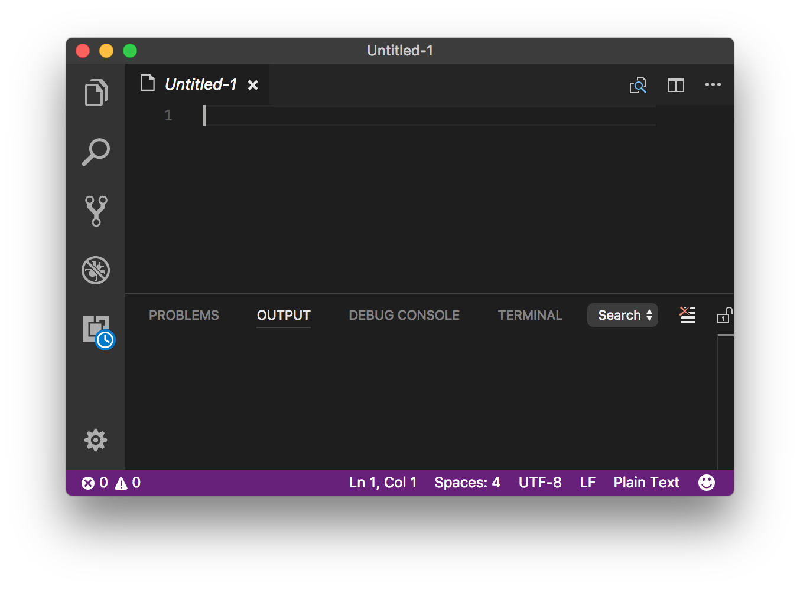

# Typescript buiten je browser

Omdat we natuurlijk niet alleen in een browser willen draaien, maar ook vanaf de commandoregel, gaan we 
een IDE (*engels voor integrated development environment*, een geintegreerde ontwikkel omgeving) installeren.

Hiervoor gebruiken we een tweetal componenten:

- node JS (hiermee installeren we de typescript transpiler)
- visual studio code (dit is een luxe tekstverwerker voor javascript en typescript)

## Stap 1: installeer NodeJS.

Ga naar  download hier NodeJS. Draai het installatieprogramma 
door erop te dubbelklikken.

## Stap 2: installeer de typescript transpiler.

Open een commandovenster (windows: `Run | cmd`, OSX: open `term`).

Geef het commando:

```
npm install -g typescript
```

NPM installeert nu de `tsc` transpiler.

## Stap 3: installeer visual studio code.

Ga naar  en download daar **visual studio insiders**.

Pak het ZIP bestand uit in een map die je weer terug kunt vinden en start deze op. Nu zie je de visual studio code 
omgeving voor je neus:



**Gefeliciteerd ! je hebt nu visual studio code werkend gekregen!**

## Stap 4: Maak een nieuw project.

Om een project aan te maken, open je een bestaande (lege) map. Deze kan je aanmaken via de explorer (windows) of de 
finder (OSX). 

Maak een nieuw bestand `tsconfig.json' aan en zet hier in:

```json
{
    "compilerOptions": {
        "target": "es5",
        "module": "commonjs",
        "sourceMap": true
    }
}
```

Je mag dit verder vergeten, maar hiermee vertellen we de typescript transpiler op welke manier en voor welke versie 
Javascript we code willen laten genereren door de TypeScript transpiler.

Klaar met je opdrachten?  
  
