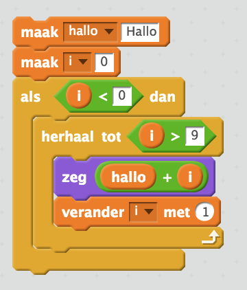

# Verder met de *while* opdracht

Een andere manier om een lus te maken dan de `for` opdracht is de `while` opdracht.

De `while` opdracht is gelukkig heel wat simpeler dan de `for` opdracht:

```typescript
let i = 0;
while (i < 10) {
    document.write("Hallo " + i + "<br>");
    i++;
}
```

Het deel wat tussen de haken staat bij de while, in dit geval `i < 10`, is een **conditie**. Deze lus gaat dus door zolang i **kleiner is dan 10.**  

Als de **conditie** niet waar is, dan wordt deze hele lus overgeslagen. In Scratch zou je dit misschien wel zo bouwen:



Complex vind je niet? Dan is het intikken van een `while` in je typescript code toch een stuk korter én het scheelt een boel klikken en slepen met de muis!

# Opdracht: spelen met while.

Probeer nu eens zelf een while lus te maken. Laat hem bijvoorbeeld beginnen op 1000 en tot 10000 lopen. 

Probeer nu eens om een while lus **naar beneden te laten tellen**. 

*Tip:* Dit kan je doen door `--` te gebruiken. 

Probeer nu eens af te tellen met een waarde van meer dan 1. Bijvoorbeeld:
 
* 1000
* 990
* 980
* 970 
* 960
* 950
* ...
* 10
* 0

Klaar met je opdrachten?  
  
**we wachten nog op de laatste aanvulling van deze typescript cursus**

